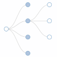
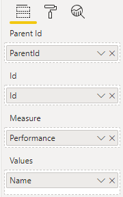
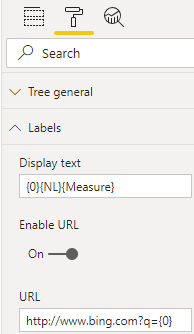

# Power BI {{ site.title }}
## {{ site.title }}
{:.floatRight}
The {{ site.title }} for Power BI is a tree structure custom visual that can be used in Power BI report. There are many ways to customise the tree visual, such as
* vertical/horizonal orientation
* custom label
* custom URL
* display label within node
* node shape
* link shape
* conditional formatting of node
* ...

## Usage 
To use {{ site.title }}, you need to have a data set which contains "parent id" and "id" in order to establish the parent-child relationship. This will allow the visual to relate parent nodes to their respective child nodes in order to render the tree.

In addition, you can optionally provide a measure and up to eight data fields as values. These data fields can then be used to format the label and/or the URL.

By default, the display text (i.e. the label) is set to {0}, which simply means the first field under Values. As up to eight fields are allowed under Values, you can use {1} to reference the second field, {2} to reference the third field, and so on up to {7}, which will refernce the eighth field. To reference the measure, use {Measure}. To add a newline, use {NL}. This same notation can also be used for the URL.

## Example


## Sample
A sample file can be downloaded [here](sample/Tree.pbix). 

## Changelog
See the list of changes [here](ChangeLog).
